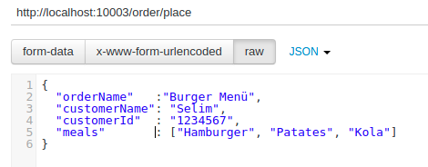
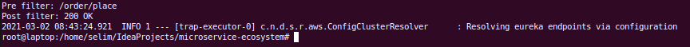
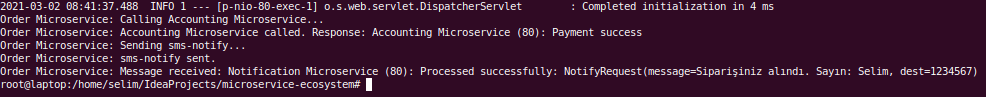
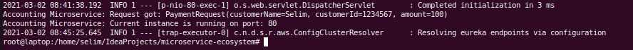
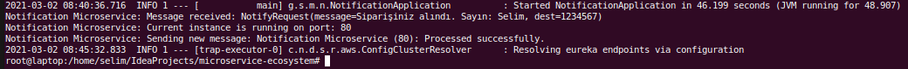

## Mikro Servis Ekosistemi ##

Bu çalışmada tipik bir mikro servis ekosisteminde yer alan bileşenler incelenmektedir.
Gerçek hayat senaryolarında bu bileşenlerden ApiGateway, Discovery Server ve Config Server'ı genelde kendimiz oluşturmaz hazır servisler olarak kullanırız.

Çalışmadaki bileşenler SpringBoot ile gerçeklenmiştir.

***Bileşenler***
1. ***Discovery Server:*** Yazılan tüm mikro servislerin ve önlerinde duran API Gateway bileşeninin kendilerini kaydettirdikleri ve IP adresleri yerine birbirlerinin isimlerini kullanarak haberleşmelerini sağlayan bileşendir. Web sitelerine IP adresi yazmak yerine domain isimlerini yazarak erişmemizi sağlayan DNS sunuculara benzetebiliriz.   
2. ***Config Server:*** Yazdığımız her servisin kendisine ait konfigurasyon dosyası mevcuttur. Ancak onlarca belki yüzlerce mikro servisin bulunduğu gerçek hayat senaryolarında bu dosyalarda yer alan değerleri değiştirmek çok pratik değildir. Bu yüzden genellikle konfigurasyon değerleri merkezi bir yapıdan alınır. Config Server bileşeni konfigurasyon değerlerini okumak için gerekli olan bilgilere sahiptir. Okunacak değerler dosya sistemindeki basit bir dosyada da olabilir, bir versiyon kontrol sisteminde yer alan dosyalar da olabilir. Genellikle Git repo'larında yer alan bir ya da bir kaç dosya ile gerçeklenir.  
3. ***API Gateway:*** Bazen mikro servislerimizi doğrudan çağırmak yerine önlerine hem güvenlik hem de yük dengeleme amaçlı olarak bir bileşen yerleştirip istekleri karşılamasını, gerekli güvenlik kontrol ya da benzeri işlemlerden sonra hedef servisi çağırmasını isteriz. Örnek ekosistemimizde API Gateway bileşeni bu amaçla kullanılmaktadır.  
4. ***Order MicroService:*** Örnek ekosistemde istekleri karşılayan ve diğer mikro servisleri senkron ve asenkron yöntemlerle çağıran mikro servistir.   
5. ***Accounting MicroService:*** Order mikro servisinin RestTemplate kullanarak senkron bir şekilde iletişim kurduğu servistir.  
6. ***Notification MicroService:*** Order mikro servisinin cloud bus (çalışmada RabbitMQ kullanılmıştır) üzerinden asenkron bir şekilde iletişim kurduğu servistir.   

Bileşenleri ayrı ayrı ya da Docker üzerinde çalıştırmak mümkündür. Her bir bileşen için gerekli dockerfile dosyaları ve ekosistemi ayağa kaldırmak için gerekli docker-compose dosyaları da çalışmada yer almaktadır.
İlk sıraya docker ile çalıştırmayı koyduğumuz için eğer IDE içinden ya da ayrı bir şekilde process olarak çalıştırılacak ise konfigurasyon dosyalarındaki PORT, CONFIG ve DISCOVERY gibi değişkenler olması gerekenler ile değiştirilmelidir. 
Bu değerler environment variable ya da command line argument olarak verilebilir. 

***./scripts/node/docker-compose.yml*** ile Discovery Server, Configuration Server ve API Gateway ve Cloud Bus (RabbitMQ) ayağa kaldırılıyor. 
***./scripts/ms/docker-compose.yml*** ile Order, Accounting ve Notification mikro servisleri ayağa kaldırılıyor.  
***./scripts/docker-image-build.sh*** ile Docker imajları oluşturulur. Bunu yapmadan önce çalışan tüm container'lar ve imajlar da silinir.

Tüm bileşenler ayağa kalktıktan sonra aşağıdaki şekilde istek gönderilebilir:

Node-APIGateway:

MS-Order:

MS-Accounting:

MS-Notification:

***Kaynaklar***  
https://github.com/osmanyaycioglu  
https://www.javainuse.com/spring/springcloud

