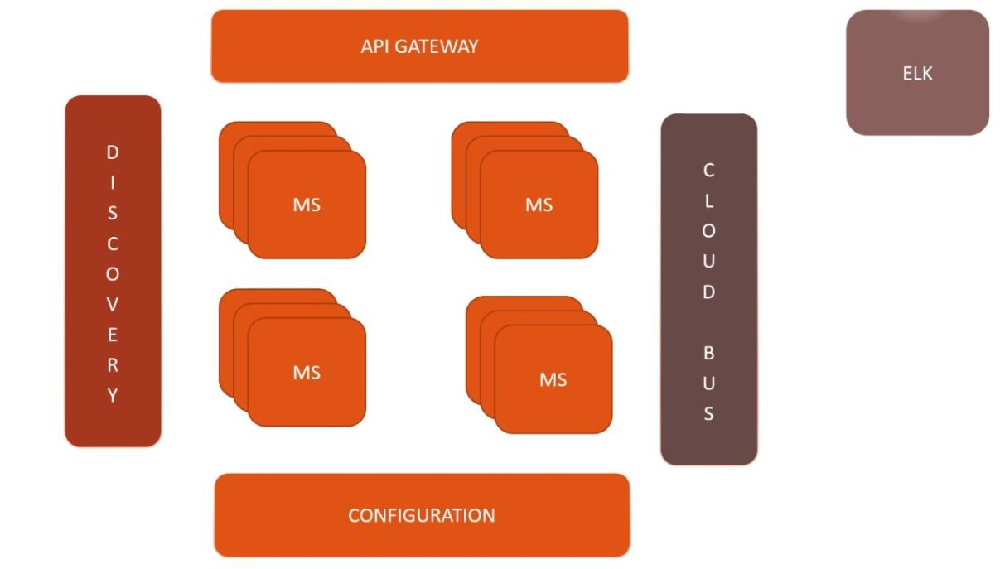

Bu çalışmada tipik bir mikro servis ekosisteminde yer alan bileşenler incelenmektedir.
Gerçek hayat senaryolarında bu bileşenlerden ApiGateway, Discovery Server ve Config Server'ı genelde kendimiz oluşturmaz ve hazır servisler olarak kullanırız.

Çalışmadaki bileşenler SpringBoot ile gerçeklenmiştir.

***Bileşenler***
1. Discovery Server: Yazılan tüm mikro servislerin ve önlerinde duran API Gateway bileşeninin kendilerini kaydettirdikleri ve IP adresleri yerine birbirlerinin isimlerini kullanarak haberleşmelerini sağlayan bileşendir. Web sitelerine IP adresi yazmak yerine domain isimlerini yazarak erişmemizi sağlayan DNS sunuculara benzetebiliriz.  
2. Config Server: 

***Yararlanılan Kaynaklar***  
https://github.com/osmanyaycioglu  
https://www.javainuse.com/spring/springcloud
